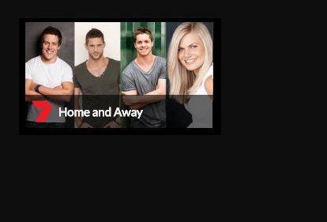

# Seven Media Take Home Test README

## Bottom Line Up Front
This project was bootstrapped with [Create React App](https://github.com/facebookincubator/create-react-app).

## The assignment
Utilise React `styled-components` on a simple React view to resemble something like:

 
## Assumptions
* A single React component will be created
* The component will take in the following props.  
    * Logo source - e.g. logo.png
    * Image source - e.g. tile.jpg
    * Image description - Steve Peacocke, Dan Ewing, Johnny Ruffo, Bonnie Sveen 
    * Show name - e.g. Home and Away
    * Display logo - e.g. true/false
    * Link URL - e.g. https://au.tv.yahoo.com/home-and-away/
* Tile will click thru to a supplied URL, eg. the show's official page.
* Data for the tile is got from a data source asynchronously.
* Browser supports flexbox

### Packages used
* Axios - For getting data
* React-Router-DOM - for routing
* DD-Breakpoints - Responsive breakpoints by Deloitte Digital - more lightweight than Bootstrap.
* Normalize CSS - for normalizing standard elements
